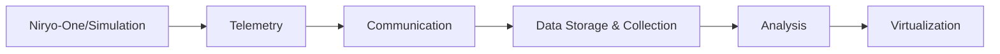
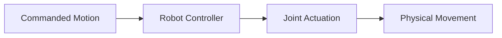
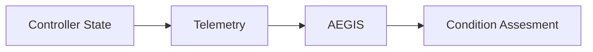

# pre-develpoment stage

```mermaid
flowchart LR
A["Niryo-One/Simulation"] --> B["Telemetry"] --> C["Communication"] -->
D["Data Storage & Collection"] --> E["Analysis"] --> F["Virtualization"]
```
---

# Conceptually the system could be considers as:

```mermaid
flowchart LR
A["Commanded Motion"] --> B["Robot Controller"] --> C["Joint Actuation"] -->
D["Physical Movement"] 
```

# With AEGIS implementation:

```mermaid
flowchart LR
A["Controller State"] --> B["Telemetry"] --> C["AEGIS"] -->
D["Condition Assesment"] 
```